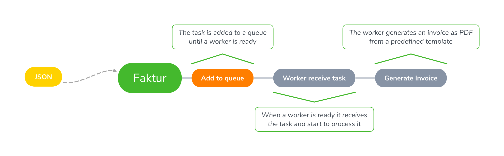

<p align="center">
  
  <h3 align="center">Faktur</h3>
  <p align="center">Invoice generator as a service.</p>
</p>

<p align="center">
  <a href="https://goreportcard.com/report/github.com/shellbear/faktur" alt="Go Report Card">
    
  </a>
  <a href="https://github.com/shellbear/faktur/actions?query=workflow%3Alint" alt="Pipeline status">
    
  </a>
  
  <a href="https://opensource.org/licenses/MIT" alt="Go version">
    
  </a>
</p>

---

## Installation

With go CLI:
```shell script
go build -o faktur .
./faktur
```

With docker:
```shell script
docker run        \
  --name faktur   \
  -p 8080:8080    \
  -d              \
  docker.pkg.github.com/shellbear/faktur/faktur
```

Or download binary from the release [page](https://github.com/shellbear/faktur/releases).

## How it works?



## Api

```
$ curl --header "Content-Type: application/json" \
    --request POST \
    --data-binary @data_example.json \
    http://localhost:8080/
```
```json
{
    "title": "StoneCrete Flooring - Invoice",
    "date": "2023-05-15T12:30:05.371Z",
    "due_date": "2023-05-27T12:30:05.371Z",
    "currency": "$",
    "contractor": {
      "logo": "https://type_your_link_here.com",
      "business_name": "StoneCrete Inc,",
      "phone": "(407)640-2333",
      "email": "office@stonecreteflooring.com",
      "registration_number": "N/A",
      "address": {
        "address": "7901 4Th St N Ste 300", 
	      "city": "St. Petersburg",
        "state": "FL",
        "zip_code": "33702"
      }
    },
    "customer": {
      "full_name": "Acme Inc,",
      "phone": "(689)250-4444",
      "email": "example@example.com",
      "terms": "NET60",
      "address": {
        "address": "212 Ronnie St", 
	      "city": "Somewhere",
        "state": "FL",
        "zip_code": "33233"
      },
      "amount_paid": "50.00",
      "customer_notes": "Payments accepted: wire transfer, check, or credit card."
    },
    "items": [

      {
        "item_number": "2005",
        "description": "Additional clear urethane top coat",
        "rate": 200.41,
        "quantity": 1.0,
        "tax_rate": 0.07
      },
      {
        "item_number": "4002",
        "description": "Epoxy Metallic blue and clear urethane coat",
        "rate": 1400.25,
        "quantity": 2.0,
        "tax_rate": 0.07
      }
    ]
}
```

## Environment variables

##### `FAKTUR_HOST`

Faktur service host address. Defaults to `127.0.0.1`.

##### `FAKTUR_PORT`

Faktur service port. Defaults to `8080`.

##### `FAKTUR_WORKERS`

The number of workers (used to create invoices). Defaults to `4`.

##### `FAKTUR_INVOICE_DIR`

The folder used to store invoices. Defaults to `./invoices`.

##### `FAKTUR_TEMPLATE_DIR`

An optional directory which contains additional invoice templates. Empty by default.

##### `FAKTUR_CACHE_DIR`

The cache folder for wkhtmltopdf. Defaults to `/tmp/cache-wk/`.

## Built with

- [pkger](https://github.com/markbates/pkger)
- [go-wkhtmltopdf](https://github.com/SebastiaanKlippert/go-wkhtmltopdf)
- <del>[basscss](https://github.com/basscss/basscss)</del>
- [getbase](https://getbase.org/)

## Credits

- Artwork by [Ashley McNamara](https://twitter.com/ashleymcnamara)
- Inspired by [Renee French](http://reneefrench.blogspot.co.uk/)

## License

© shellbear, 2020~time.Now
© StoneCrete, 2023~time.Now

Released under the [MIT License](LICENSE).